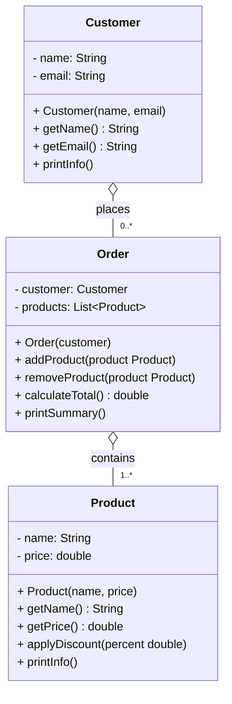

# OOP

## Exercise 1 — Online Shop

A small online shop lets customers browse a product catalog and place orders. Each order belongs to one customer and can contain multiple products. The shop needs to track what was ordered, by whom, and what the total cost is.

You will implement this system as one app with three classes: `Customer`, `Product`, and `Order`.

### Class Diagram

Study this diagram before you start writing any code. Understand what each class holds, what it can do, and how the classes connect.

**Relationship type:** Both are **aggregation** (`o--`) — products exist in the catalog before and after any order; orders exist independently of the session that created them. The `"1"` on the left of each arrow is omitted because Mermaid does not render `o--` with multiplicity on both sides — full reading: `Customer (1) ◇── (0..*) Order` and `Order (1) ◇── (1..*) Product`.

### Implementation

Build the three classes based on the diagram above.

**`Product`**
- Constructor: reject a blank name or a negative price
- `applyDiscount(double percent)` — reduces the price by that percentage; reject a discount above 80%
- `printInfo()` — prints the product name and current price

**`Customer`**
- Constructor: reject a blank name or a blank email
- `printInfo()` — prints the customer's name and email

**`Order`**
- Created with a `Customer` — the customer cannot change after the order is placed
- `addProduct` / `removeProduct` — update the internal list
- `calculateTotal()` — returns the sum of all product prices
- `printSummary()` — prints the customer's name, each product, and the total

### Demonstrate in `App`

Run the following flow and show the output:

1. Create two products — apply a discount to one
2. Create a customer
3. Place an order for that customer — add both products
4. Print the order summary
5. Remove one product and print the summary again to show the total updated

---

## Exercise 2 (Optional) — The Parking Lot

*Design the classes yourself. There is no class diagram given — read the scenario, decide what exists, how things connect, and build it. Draw your own class diagram when you are done.*

---

A parking lot in central Stockholm wants to replace its paper log with a digital system.

When a car arrives, the attendant finds a free spot, assigns the car to it, and creates a ticket. The ticket records the spot number and the time the car arrived. When the car leaves, the ticket is closed and the system prints how long the car was parked. The ticket belongs to that session — it has no meaning without it.

The parking lot holds a fixed number of spots. Each spot is either free or occupied. The attendant does not own the spots — they interact with whichever one is needed at that moment.

### What the system must do

- Track which spots are free and which are occupied
- When a car arrives: find a free spot, mark it occupied, create a ticket with the spot number and arrival time
- When a car leaves: close the ticket, print the duration, and free the spot
- If no spots are available when a car arrives: print a message instead of assigning a spot

### Demonstrate in `App`

Run this flow and show the output:

1. Set up a parking lot with 3 spots
2. Three cars arrive one by one — each is assigned a spot
3. A fourth car arrives — no free spots, print the message
4. The first car leaves — print the duration and free its spot
5. The fourth car arrives again — it now gets the freed spot

> **Think:** who creates the ticket — the spot, the attendant, or the parking lot? Your answer determines the relationship type. Be ready to defend it.

Draw a class diagram for your solution — classes, fields, methods, relationship arrows, and multiplicity.

---