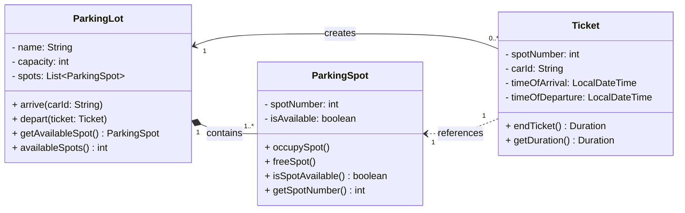

# The Parking Lot Class Diagram

This is seriously tricky. I definitely need more practice designing class diagrams.

```mermaid
classDiagram
    direction LR
    class ParkingLot {
        - name: String
        - capacity: int
        - spots: List~ParkingSpot~
        + arrive(carId: String)
        + depart(ticket: Ticket)
        + getAvailableSpot() ParkingSpot
        + availableSpots() int
    }

    class ParkingSpot {
        - spotNumber: int
        - isAvailable: boolean
        + occupySpot()
        + freeSpot()
        + isSpotAvailable() boolean
        + getSpotNumber() int
    }

    class Ticket {
        - spotNumber: int
        - carId: String
        - timeOfArrival: LocalDateTime
        - timeOfDeparture: LocalDateTime
        + endTicket() Duration
        + getDuration() Duration
    }

%% One ParkingLot can have 1 or many ParkingSpots
%% A ParkingLot contains 1 or many ParkingSpots
    ParkingLot "1" *-- "1..*" ParkingSpot: contains
%% One ParkingLot can have 0 or many active Tickets
%% A ParkingLot creates 0 or many active Tickets
    ParkingLot "1" <-- "0..*" Ticket: creates
    ParkingSpot "1" <.. "1" Ticket: references
```